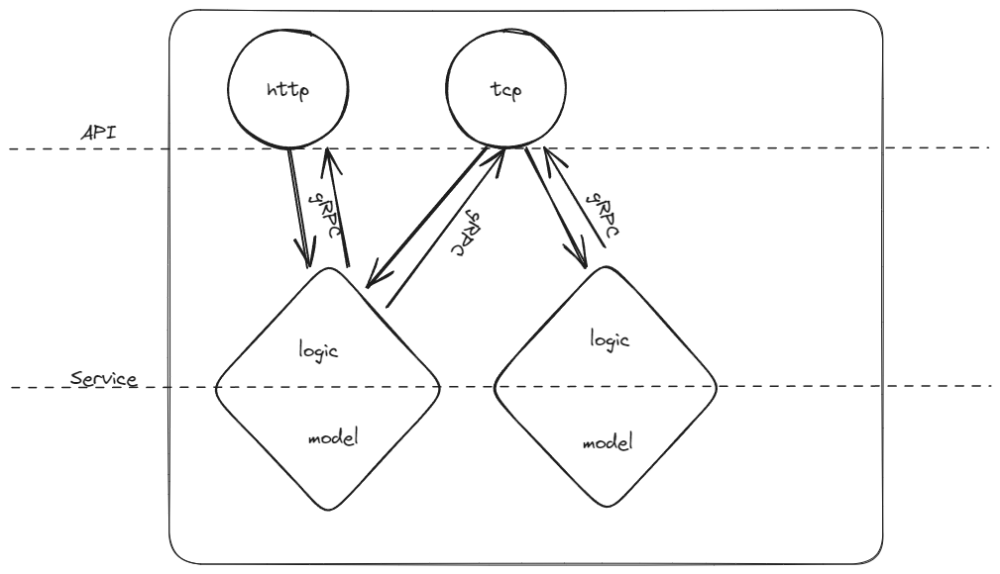

# GOBOOT 指南

- [GOBOOT 指南](#goboot-指南)
  - [概述](#概述)
  - [组成](#组成)
  - [连接](#连接)
  - [服务](#服务)
  - [实例](#实例)
  - [最佳实践](#最佳实践)
  - [配置](#配置)
  - [参考文件](#参考文件)


## 概述

`GOBOOT`是一个golang开发的游戏服开发框架。可以用于开发，游戏周边系统，游戏后台系统（无物理部分）。也可以用于开发其他应用系统。实现了`HTTP`，`TCP`，`KCP`, `Websocket`协议的接入。

`GOBOOT`使用分层架构设计，同时借鉴`DDD`(领域驱动设计)的优秀设计。遵循`连接-逻辑-数据`分层，同时根据业务划分成各自领域，每个领域之间通过通信机制交互。

## 组成



## 连接

`GOBOOT`通过建立API，来开放访问的连接。存在两种API，分别是`httpapi`和`gameapi`。

* httpapi: 接受http连接，短链接服务实现。
* gameapi: 接受`TCP`，`KCP`，`Websocket`，长链接服务实现。

## 服务

`GOBOOT`将逻辑和数据合并成`Service`，因为逻辑本省依赖着数据。同时，每一个`Servcie`可以看作一个领域，因此通过构造实现的隔离。将逻辑需要的数据，通过注入到上下文的方式，提供给逻辑使用。

每个服务都是`gRPC`实例的实现，因此服务间的调用，以及API调用Service都是通过`gRPC`调用来实现。

## 实例

实例是领域的最小划分单位，它可以是一个API或是Service。也可以说，每一个API或Service都是一个实例。但，实例并不是一个进程，它是一组进程统称。而实例的一个节点，则对应一个进程，监听一个端口。也就是说，实例是个统称，但是启动时，则表示它成了一个具体的实例节点。

因此，每个实例必须要有四个配置项，作为启动的必须参数。因此，在最佳实践中，`GOBOOT`推荐这四个参数项目作为进程的启动输入参数，分别是：

* name: 实例名称，用户区分实例的用途，同时也是服务注册时使用的区分参数。取名时，要突出业务，例如`UserService`，`AccountApi`。
* addr: 监听地址，每个**实例节点**都必须有一个监听的地址，用于被调用时使用。
* configPath: 此实例节点启动时，使用的`yaml`配置文件路径。
* instanceId：实例节点的ID，用于区分多个实例节点的标识。

## 最佳实践

* [HTTP API的最佳实践](./httpapi.md)
* [Game API的最佳实践](./gameserver.md)
* [Service的最佳实践](./Service.md)
* [bootctl命令行工具](./bootctl.md)

## 配置

配置文件都是使用yaml，有关配置项，参考最佳实践。需要注意的是，默认配置文件目录在根目录下的`configs/`文件夹。

无论是API实例还是Service实例，都有的配置是日志配置：


```yaml
# 日志配置
Logger:
  # 日志输出级别，debug->info->warn->error
  Level: "debug"
  # 日志文件的输出分类，文件名是 {target}_{instanceId}.log
  Target: "gameserver.api"
  # 日志输文件夹
  Outpath: "./logs"
```


## 参考文件

* [echo文档](https://echo.labstack.com/docs/category/guide)
* [gRPC](https://grpc.io/docs/languages/go/quickstart/)
